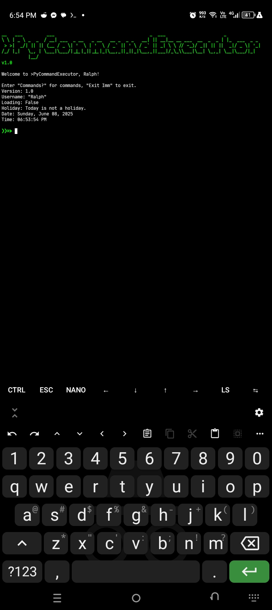

# PyCommandExecutor

A simple tool.

## Features

- Calculate arithmec expressions into the command prompt.
- Execute multiple commands.

## Screenshot



## Contributing

Pull requests are welcome! Feel free to open an issue or submit a PR for improvements.

## Installation

Run this command in your terminal:

```bash
apt update && apt upgrade
apt install git python
git clone https://github.com/AnonymousUser12345-droid/PyCommandExecutor
cd PyCommandExecutor
pip install -r requirements.txt
```

