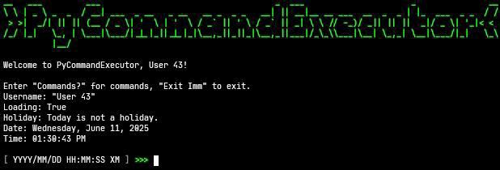

# PyCommandExecutor

## Commands

```plain
- Commands?
- ShowCommandHistory
- DeleteCommandHistory
- Clear
- DeleteData
- RerunCode
- UpdateCode
- Exit NA or (Imm)
- ChangeUsername <<Username>>
- Time
- DaysUntil <<Year/Month/Day>> NA or <<Year/Month/Day>>
- Calendar NA or <<Year>>
- Timer <<Hour:Minute:Second>> or <<Minute:Second>>
- Stopwatch (Start) or (Stop) or (Reset)
- SelectRandomItem <<Items>>
- SelectRandomNumber <<Number>> <<Number>>
- GeneratePassword <<Length>> <<Quantity>> NA or (Letters) NA or (Numbers) NA or (SpecialCharacters)
- CheckPasswordStrength <<Password>>
- GenerateUsername <<Quantity>>
- Matrix
- TimeToLoadUrl <<Url>>
- CheckInternet
- CheckInternetSpeed
```

## Screenshot



## Installation

```bash
pkg update && pkg upgrade
pkg install git python
git clone https://github.com/AnonymousUser12345-droid/PyCommandExecutor
cd PyCommandExecutor
pip install -r requirements.txt
python Main.py
```

## Dependencies

- [password-strength](https://pypi.org/project/password-strength/)
- [requests](https://pypi.org/project/requests/)
- [simpleeval](https://pypi.org/project/simpleeval/)
- [speedtest-cli](https://pypi.org/project/speedtest-cli/)
- [zxcvbn](https://pypi.org/project/zxcvbn/)
