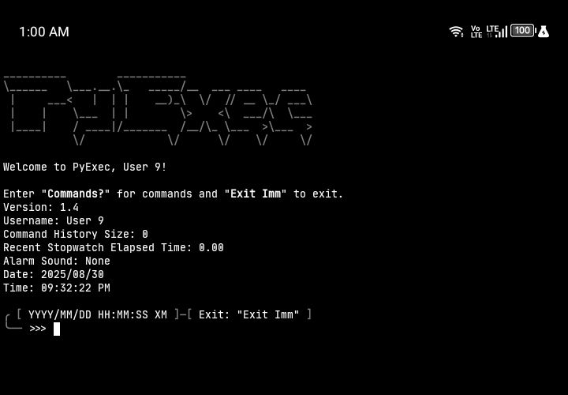

# PyCommandExecutor

**PyCommandExecutor** is a multifunctional command-line tool that combines a wide range of utilities into a single terminal interface. With built-in commands for calculations, password generation, internet checks, timers, and more.

## Commands

```plain
- Commands?
- ShowCommandHistory
- DeleteCommandHistory
- Clear
- Reset
- SelfDestruct
- RerunCode
- UpdateCode
- Exit NA｜(Imm)
- ChangeUsername <<Username>>
- Loading (True)｜(False)｜(Check)
- Time
- DaysUntil <<Year/Month/Day>> NA｜<<Year/Month/Day>>
- Calendar NA｜<<Year>>
- Timer <<Hour:Minute:Second>>｜<<Minute:Second>>
- Stopwatch (Start)｜(Stop)｜(Reset)
- SelectRandomItem <<ListOfItems>>
- SelectRandomNumber <<Number>> <<Number>>
- GeneratePassword <<Length>> <<NumberOfPasswords>> NA｜(Letters) NA｜(Numbers) NA｜(SpecialCharacters)
- CheckPasswordStrength <<Password>>
- GenerateUsername <<NumberOfUsernames>>
- Matrix
- TimeToLoadUrl <<Url>>
- CheckInternet
- CheckInternetSpeed
```

## Screenshot



## Installation

```bash
pkg update && pkg upgrade
pkg install git python
git clone https://github.com/AnonymousUser12345-droid/PyCommandExecutor
```

## Run

```bash
cd PyCommandExecutor
python Main.py
```

## Dependencies

- [holidays](https://pypi.org/project/holidays/)
- [password-strength](https://pypi.org/project/password-strength/)
- [requests](https://pypi.org/project/requests/)
- [simpleeval](https://pypi.org/project/simpleeval/)
- [speedtest-cli](https://pypi.org/project/speedtest-cli/)
- [zxcvbn](https://pypi.org/project/zxcvbn/)