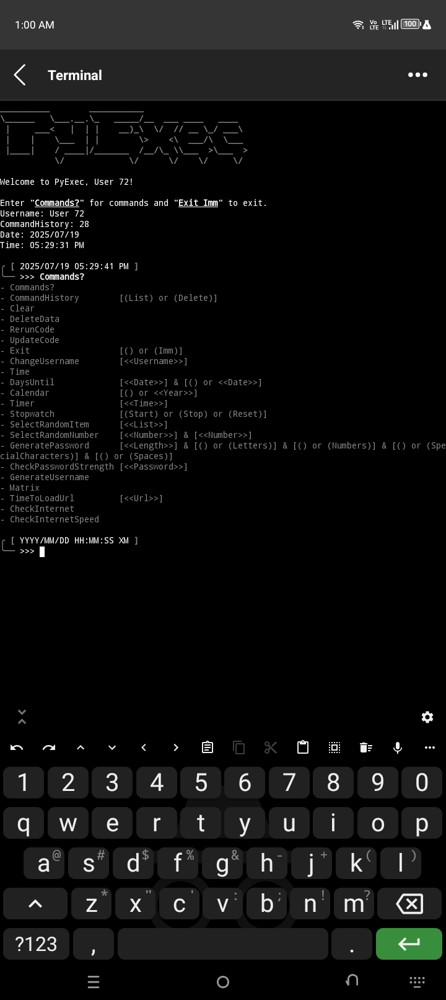

# PyExec

## 🧑‍💻 Commands

```plain
Command                Argument
- Commands?
- CommandHistory       [(List) or (Delete)]
- Clear
- DeleteData
- RerunCode
- UpdateCode
- Exit                 [() or (Imm)]
- ChangeUsername       [<<Username>>]
- Time
- DaysUntil            [<<Date>>] & [() or <<Date>>]
- Calendar             [() or <<Year>>]
- Timer                [<<Time>>]
- Stopwatch            [(Start) or (Stop) or (Reset) or (RecentElapsedTime)]
- RandomChoice         [<<List>>]
- RandomInteger        [<<Integer>>] & [<<Integer>>]
- GenerateUsername
- GenerateFakeIdentity [
- Matrix
- TimeToLoadUrl        [<<Url>>]
- CheckInternet
- CheckInternetSpeed
```
## 📷 Screenshot



## 🛠️ Installation

```bash
pkg update && pkg upgrade
pkg install git python
git clone https://github.com/AnonymousUser12345-droid/PyExec
cd PyExec
python main.py
```

## 📦 Dependencies & 🛠️ Installation

- [Faker](https://pypi.org/project/Faker)
- [password-strength](https://pypi.org/project/password-strength/)
- [requests](https://pypi.org/project/requests/)
- [simpleeval](https://pypi.org/project/simpleeval/)
- [speedtest-cli](https://pypi.org/project/speedtest-cli/)
- [zxcvbn](https://pypi.org/project/zxcvbn/)
```bash
pip install Faker password-strength requests simpleeval speedtest-cli zxcvbn
```
- [play-audio](https://github.com/termux/play-audio)
```bash
pkg install play-audio
```